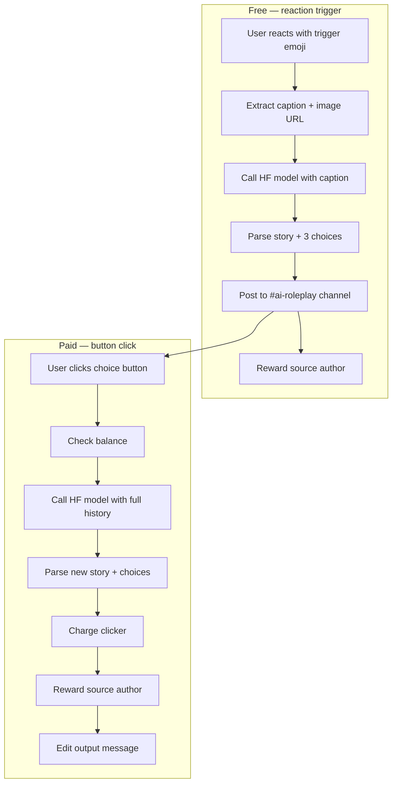

# AI Roleplay Module — Architecture

Reaction-triggered, multi-turn AI roleplay for Discord. A user reacts to an image/caption message with a configured emoji; the bot calls **DeepSeek-V4-Pro** via Hugging Face Inference, posts the story to a dedicated channel with choice buttons, and continues the story when users pay to click a button.

Designed as a **self-contained module** under `src/modules/aiRoleplay/` so it can be extracted into a separate bot later.

---

## Table of contents

1. [High-level overview](#high-level-overview)
2. [Design principles](#design-principles)
3. [Directory structure](#directory-structure)
4. [Database schema](#database-schema)
5. [Configuration & gating](#configuration--gating)
6. [Bot integration](#bot-integration)
7. [Reaction trigger flow](#reaction-trigger-flow)
8. [Button continuation flow](#button-continuation-flow)
9. [AI API layer](#ai-api-layer)
10. [Response parsing](#response-parsing)
11. [Input extraction & moderation](#input-extraction--moderation)
12. [Session management](#session-management)
13. [Economy](#economy)
14. [Discord output format](#discord-output-format)
15. [Admin UI & API](#admin-ui--api)
16. [Environment & dependencies](#environment--dependencies)
17. [Known limitations](#known-limitations)

---

## High-level overview



| Action | Cost | Who pays | Who gets rewarded |
|--------|------|----------|-------------------|
| React with trigger emoji | Free | — | Source message author (`authorRewardOnTrigger`) |
| Click a choice button | `buttonCost` coins | Clicker | Source message author (`authorRewardOnChoice`) |

- **Text-only to the model** — only the caption and conversation history are sent to the API. The source image is attached in the Discord post as an embed for readers.
- **One session per reaction** — each emoji reaction creates a new `RoleplaySession` and a new post in `#ai-roleplay`. The same user may react again on the same source message for another free session.
- **Anyone** can react (including on their own messages) or click buttons.

---

## Design principles

1. **One function per file** — each util/handler lives in its own file for clarity and future extraction.
2. **Dependency injection at the boundary** — `registerAiRoleplay()` wires `prisma`, `updateBalance`, and `getUserCashBalance` into handlers without the module importing bot-specific globals elsewhere.
3. **Per-guild configuration in the database** — no hardcoded economy defaults; all costs and prompts are set via the admin UI.
4. **Guild gating** — the feature is inactive unless the guild has both an `ai-roleplay` channel mapped and a `GuildAiRoleplayConfig` row.
5. **Charge after success** — button clicks only deduct coins after the model returns a parseable response.

---

## Directory structure

```
src/modules/aiRoleplay/
├── index.ts                          # registerAiRoleplay(), public exports
├── constants.ts                      # HF model, TTL, banned words, JSON instruction
├── types.ts                          # Shared interfaces
├── handleReactionTrigger.ts          # Emoji reaction entry point
├── handleChoiceButton.ts             # Button interaction entry point
│
├── api/
│   └── roleplayClient.ts             # OpenAI SDK → Hugging Face router
│
├── config/
│   ├── loadGuildRoleplayConfig.ts    # Load merged guild + DB config
│   └── isRoleplayConfigComplete.ts   # Validate all required fields are set
│
├── discord/
│   ├── createChoiceButtonId.ts
│   ├── parseChoiceButtonId.ts
│   ├── truncateLabel.ts
│   ├── buildChoiceComponents.ts
│   ├── buildRoleplayMessagePayload.ts
│   ├── emojiMatchesTrigger.ts
│   ├── notifyReactor.ts
│   ├── buildGuildEconomyContext.ts
│   └── build*Message.ts              # User-facing status strings
│
├── economy/
│   ├── buildEconomyUser.ts
│   ├── chargeUser.ts
│   └── rewardUser.ts
│
├── extraction/
│   └── extractRoleplayInput.ts
│
├── parsing/
│   ├── containsAnyOf.ts              # Generic: does text contain any term?
│   ├── containsBannedWord.ts         # Wrapper using ROLEPLAY_BANNED_WORDS
│   ├── tryParseJson.ts
│   ├── splitParagraphs.ts
│   ├── extractQuestionChoices.ts
│   ├── parseQuestionsFromStory.ts
│   └── parseModelResponse.ts         # JSON first, regex fallback
│
└── sessions/
    ├── createRoleplaySession.ts
    ├── getSessionWithTurns.ts
    ├── appendSessionTurn.ts
    ├── updateSessionOutput.ts
    └── isSessionExpired.ts
```

---

## Database schema

### `GuildAiRoleplayConfig` (1:1 with `Guild`)

| Column | Type | Purpose |
|--------|------|---------|
| `guildId` | PK | Links to `Guild` |
| `triggerEmoji` | string | Unicode emoji or custom emoji id/format |
| `systemPrompt` | text | Guild-specific roleplay instructions |
| `buttonCost` | int | Coins charged per button click |
| `authorRewardOnTrigger` | int | Coins to source author on reaction |
| `authorRewardOnChoice` | int | Coins to source author per button click |
| `thinkingMode` | boolean | Higher temperature when true |

### `RoleplaySession`

| Column | Purpose |
|--------|---------|
| `id` | CUID — embedded in button `customId` |
| `guildId` | Owning guild |
| `sourceMessageId/ChannelId/Url` | Original reacted message |
| `sourceAuthorId` | Author of the source message (reward recipient) |
| `initiatorId` | User who reacted |
| `sourceCaption` / `sourceImageUrl` | Extracted input |
| `outputMessageId` / `outputChannelId` | Bot's post in `#ai-roleplay` |
| `pendingChoices` | JSON array of current button labels/values |
| `expiresAt` | Session TTL (1 hour, extended on activity) |

### `RoleplayTurn`

Conversation history rows: `role` (`user` | `assistant`) + `content`.

Migration: `prisma/migrations/20260601180000_ai_roleplay/`

---

## Configuration & gating

A guild participates in AI roleplay only when **all** of the following are true:

1. **`GuildChannel`** row exists with `name = "ai-roleplay"` and a valid Discord channel ID.
2. **`GuildAiRoleplayConfig`** row exists for the guild.
3. **`isRoleplayConfigComplete()`** passes — every field is non-empty and costs are non-negative integers.
4. **Economy channel + currency** are mapped (`economy` channel slot + `GuildCurrency` row).

`loadGuildRoleplayConfig(prisma, guildDiscordId)` merges:

- `Guild.aiRoleplayConfig`
- `GuildChannel` where `name === AI_ROLEPLAY_CHANNEL_NAME`
- `GuildChannel` where `name === ECONOMY_CHANNEL_NAME`
- First `GuildCurrency` row

If the guild has config + `ai-roleplay` channel but incomplete settings, a reaction matching the trigger emoji still returns `true` (handled) and DMs the reactor: *"AI roleplay is not configured for this server."*

If there is no config or no `ai-roleplay` channel, reactions are ignored (`false`).

---

## Bot integration

### Startup

`src/utils/apiUtils/discordUtils/initClient.ts` calls `registerAiRoleplay()` before attaching listeners.

### Listeners

| Listener | Hook | Order |
|----------|------|-------|
| `messageReactionAdd` | `tryHandleAiRoleplayReaction()` | After bot/author checks, **before** self-react skip and coin-reward logic |
| `interactionCreate` | `tryHandleAiRoleplayButton()` | Before paid-request button handler |

Handlers return `boolean`:

- `false` — not an AI roleplay event; fall through to other handlers.
- `true` — handled (or attempted); stop processing.

### Injected dependencies (`AiRoleplayDeps`)

```typescript
{
  prisma: PrismaClient;
  updateBalance: (client, params) => Promise<void>;  // UnbelievaBoat
  getUserCashBalance: (guildDiscordId, userId) => Promise<number>;
}
```

---

## Reaction trigger flow

**Entry:** `tryHandleAiRoleplayReaction(client, reaction, user)`

```
1. Load guild config
2. If no config or emoji doesn't match → return false
3. If config incomplete → DM reactor, return true
4. Fetch full message if partial
5. extractRoleplayInput(message)
   - Reject video/audio attachments
   - Require caption and/or image
6. containsBannedWord(caption) → DM "Not allowed.", return true
7. DM "Generating your roleplay..."
8. createRoleplaySession() — stores caption as first user turn
9. callRoleplayModel({ systemPrompt, messages: [caption] })
10. parseModelResponse(raw)
11. Post to #ai-roleplay via buildRoleplayMessagePayload()
12. updateSessionOutput() — save output message id, choices, assistant turn
13. rewardUser(sourceAuthor, authorRewardOnTrigger) if > 0
```

**Notifications:** Reactions cannot send Discord ephemerals. Status messages are sent via **DM** (`notifyReactor`). If DMs are closed, the user may not see feedback.

**Concurrency:** Multiple users reacting on the same source message each spawn independent sessions and posts.

---

## Button continuation flow

**Entry:** `tryHandleAiRoleplayButton(client, interaction)`

**Button customId format:** `ai-rp:{sessionId}:{choiceIndex}`

```
1. parseChoiceButtonId(customId) → if no match, return false
2. Load + validate guild config
3. Load session + verify guildId matches
4. isSessionExpired(expiresAt) → ephemeral error
5. Resolve selectedChoice from session.pendingChoices[choiceIndex]
6. containsBannedWord(selectedChoice) → ephemeral "Not allowed."
7. getUserCashBalance < buttonCost → ephemeral insufficient funds
8. Ephemeral "Generating..."
9. Build messages = session.turns + new user choice (in memory)
10. callRoleplayModel()
11. parseModelResponse() — on failure, followUp error, NO charge
12. chargeUser(clicker, buttonCost)
13. rewardUser(sourceAuthor, authorRewardOnChoice) if > 0
14. appendSessionTurn(user, selectedChoice)
15. Edit existing output message with new story + buttons
16. updateSessionOutput() — new choices + assistant turn, extend TTL
```

**Who can click:** Anyone with sufficient balance. No ownership check on the session.

---

## AI API layer

**File:** `api/roleplayClient.ts`

| Setting | Value |
|---------|-------|
| SDK | `openai` (OpenAI-compatible client) |
| Base URL | `https://router.huggingface.co/v1` |
| Model | `deepseek-ai/DeepSeek-V4-Pro:novita` |
| Auth | `process.env.HF_TOKEN` |

Each request sends:

1. **System message** — guild `systemPrompt` + `JSON_RESPONSE_INSTRUCTION` (asks for `{"story":"...","choices":["...","...","..."]}`).
2. **User/assistant messages** — conversation history.

`thinkingMode`:

- `false` → `temperature: 0.9`
- `true` → `temperature: 1.0`

The model does **not** receive image bytes — only text.

---

## Response parsing

**Orchestrator:** `parseModelResponse(raw)`

### 1. JSON path (`tryParseJson`)

- Finds first `{` … last `}` in the response.
- Expects `{ story: string, choices: string[] }`.
- Trims and caps choices at `MAX_CHOICES` (3).

### 2. Regex fallback (`parseQuestionsFromStory`)

Used when JSON parsing fails:

1. `splitParagraphs(raw)` — split on blank lines.
2. Last paragraph → question source.
3. `extractQuestionChoices(lastParagraph)` — match `/[^?]+\?/g`.
4. Earlier paragraphs → `story`.
5. Fallback: split last paragraph on `?` if no regex matches.

If both paths fail, the handler reports generation failure and does not post/edit.

---

## Input extraction & moderation

**`extractRoleplayInput(message)`**

| Attachment type | Allowed |
|-----------------|---------|
| Images (jpeg, png, gif, webp, etc.) | Yes — first image URL used |
| Video | No — entire message rejected |
| Audio | No — entire message rejected |
| Caption only | Yes — `"(no caption)"` if empty but image present |
| Neither caption nor image | Rejected |

**Banned words**

- `ROLEPLAY_BANNED_WORDS` in `constants.ts` (same values as image-gen `BANNED_WORDS`, separate const).
- `containsAnyOf(terms, text)` — generic case-insensitive substring check.
- `containsBannedWord(text)` — wrapper for roleplay list.
- Checked on **input caption** (reaction) and **selected choice** (button) before API calls.

---

## Session management

| Function | Purpose |
|----------|---------|
| `createRoleplaySession` | New session + initial user turn (caption), `expiresAt = now + 1h` |
| `getSessionWithTurns` | Load session with ordered turns |
| `appendSessionTurn` | Add user turn, extend TTL |
| `updateSessionOutput` | Add assistant turn, update `pendingChoices`, optional output ids, extend TTL |
| `isSessionExpired` | `expiresAt <= now` |

**TTL:** `SESSION_TTL_MS = 60 * 60 * 1000` (1 hour). Extended on every turn append and output update.

**No max turn limit** — bounded only by cost per button click.

---

## Economy

All amounts are **per-guild** from `GuildAiRoleplayConfig`. No code defaults.

| Event | Function | Amount |
|-------|----------|--------|
| Reaction trigger | `rewardUser` → source author | `authorRewardOnTrigger` |
| Button click (after success) | `chargeUser` → clicker | `-buttonCost` |
| Button click (after success) | `rewardUser` → source author | `authorRewardOnChoice` |

Uses existing `updateBalance()` → UnbelievaBoat API + economy channel embed.

`buildGuildEconomyContext(config)` maps guild Discord id, economy channel id, and currency metadata.

---

## Discord output format

**Post content:**

```
<@sourceAuthorId> [original message](sourceMessageUrl)

{story paragraphs}
```

**Embed:** source image URL (if present).

**Components:** one `ActionRow` with up to 3 `ButtonBuilder` entries.

- Label: truncated to 80 chars (`truncateLabel`).
- `customId`: `ai-rp:{sessionId}:{index}`.
- Full choice text stored in `session.pendingChoices` (not in `customId` — 100 char limit).

**On button click:** the existing output message is **edited** in place (same message id). Falls back to a new send in `#ai-roleplay` if the output channel/message is missing.

---

## Admin UI & API

### Channel slot

`AI_ROLEPLAY_CHANNEL_NAME = "ai-roleplay"` — added to `admin/slotNames.ts` and configured per guild on the **Channels** tab.

### AI Roleplay tab (per guild)

| Field | DB column |
|-------|-----------|
| Trigger emoji | `triggerEmoji` |
| System prompt | `systemPrompt` |
| Button click cost | `buttonCost` |
| Author reward on trigger | `authorRewardOnTrigger` |
| Author reward on button click | `authorRewardOnChoice` |
| Thinking mode | `thinkingMode` |

### API routes (`src/admin/routes/guilds.ts`)

| Method | Path | Purpose |
|--------|------|---------|
| GET | `/api/guilds/:id` | Includes `aiRoleplay` config in response |
| GET | `/api/guilds/:id/ai-roleplay` | Config only |
| PUT | `/api/guilds/:id/ai-roleplay` | Upsert config (all fields required) |

Validation uses `parseNonNegativeInt()` from `src/utils/string/parseNonNegativeInt.ts`.

### Guild deletion

`deleteGuildWithRelations` explicitly deletes `RoleplaySession` and `GuildAiRoleplayConfig` before the guild row (FK cascade also applies).

---

## Environment & dependencies

| Variable / package | Purpose |
|--------------------|---------|
| `HF_TOKEN` | Hugging Face Inference API key |
| `DATABASE_URL` | Prisma — sessions + config |
| `UNBELIEVABOAT_TOKEN` | Economy balance read/write |
| `openai` npm package | Chat completions client for HF router |

---

## Known limitations

1. **No true ephemeral on reactions** — feedback goes via DM; silent if DMs disabled.
2. **Text-only model input** — image context is visual in Discord only, not sent to DeepSeek.
3. **No refund on partial failure after charge** — charge happens only after successful parse, but if `edit` or DB update fails after charge, coins are not automatically refunded.
4. **Button labels may truncate** — full choice text is in DB; Discord label max is 80 chars.
5. **No rate limiting** — concurrent reactions spawn parallel HF calls.
6. **Expired sessions** — buttons are not proactively disabled on the message; clicks are rejected at interaction time.
7. **Config required before use** — no code-level defaults for economy fields; admin must configure every value.

---

## Quick setup checklist

1. Run migration: `yarn prisma:migrate`
2. Set `HF_TOKEN` in bot environment
3. In admin, per guild:
   - Map `ai-roleplay` channel on **Channels** tab
   - Fill all fields on **AI Roleplay** tab
   - Ensure `economy` channel + currency are configured
4. Deploy bot with `openai` dependency
5. Users react to image/caption messages with the configured emoji
